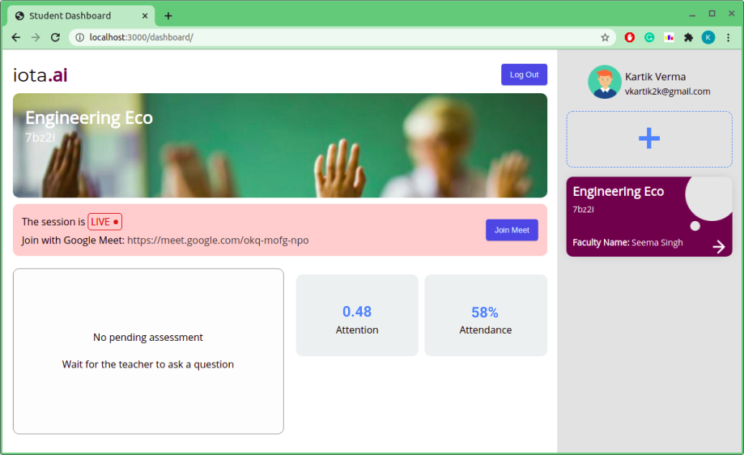
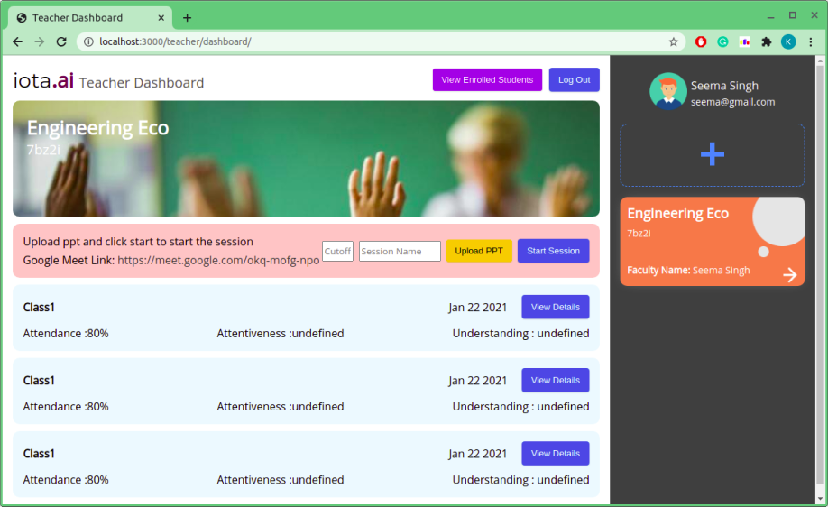
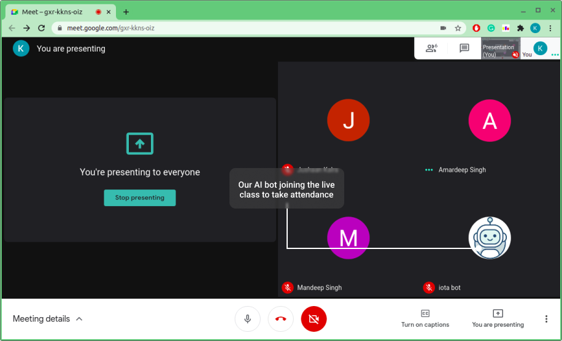

# IOTA - Intelligent Online Teaching Assistant

IOTA stands for Intelligent Online Teaching Assistant, and as the name suggests, it is a teaching assistant built for online classes. Students attending online classes often find it boring due to low interactivity, which leads to less productivity. Iota.ai is a simple web-based classroom tool, powered by an AI algorithm that enables the teacher to ask automated AI-generated questions to the students randomly. This not only helps students to make class interactive but also makes it possible to measure the overall understanding and attentiveness of a class.

The questions asked are generated using a Natural Language Processing technique that takes the content (covered in class) as the input, and the question is asked from the students to gauge their attentiveness(whether they are present in the class) as well as understanding(whether they understood the concepts taught in the class). We also provide a feature to automatically take attendance using a Google Meet Bot which joins in the class as soon as the class is started.

Unlike Google Classroom, this is a classroom that is used during live-class supporting unique features like tracking attendance, attentiveness and understanding of each student!

## Tech Stack


<p align="left">


</p>

## Main Features

1. Real-Time Classroom
2. Pop-up AI questions during live class
3. Attendance using AI Bot
4. ERP to track attendance, alertness and understanding

## Quick Access to Files

Dashboard - [HTML](NodeJS_Server/dashboard/index.html) [JS](NodeJS_Server/dashboard/index.js)


Index file for NodeJS_Server - [JS](NodeJS_Server/index.js)


Instruction to run Flask_server - [Instructions](Flask_Server/readme.md)


Index file for Flask_Server - [Python_File](Flask_Server/run_api.py)


## Instruction to setup

### Node Server

```console
iota@admin:~$ cd NodeJS_Server
iota@admin:~$ npm install
iota@admin:~$ node index.js
```

### Flask_Server

Steps to execute Flask_Server are provided [here](Flask_Server/readme.md)

Make sure you setup Virtual Enviroment before running the server named venv and install all dependencies for python code

```console
iota@admin:~$ source venv/bin/activate
iota@admin:~$ cd Flask_Server/
iota@admin:~$ cd Flask_Server/
iota@admin:~$ python3 run_api.py 
```
### Java - Stanford Lex Parser Server

Make sure you installed stanford package in lib directory present in Flask_Server/lib

#### Stanford Parser Requirements

1. Make sure java is installed on your system
2. Download and unzip [https://nlp.stanford.edu/software/lex-parser.shtml](https://nlp.stanford.edu/software/lex-parser.shtml)
3. Copy the content to lib folder

```console
iota@admin:~$ java -cp stanford-postagger.jar edu.stanford.nlp.tagger.maxent.MaxentTaggerServer -model models/english-left3words-distsim.tagger -port 9000
```


## Student Dashboard


## Teacher Dashboard


## iota.ai BOT



<a href="https://www.producthunt.com/posts/awesome-github-profiles?utm_source=badge-featured&utm_medium=badge&utm_souce=badge-awesome-github-profiles" target="_blank"></a></h1>
<div align="center">

<a href="https://arbeitnow.com/?utm_source=awesome-github-profile-readme"></a>
<!--  -->

<a href="https://discord.gg/XTW52Kt"></a><br>
