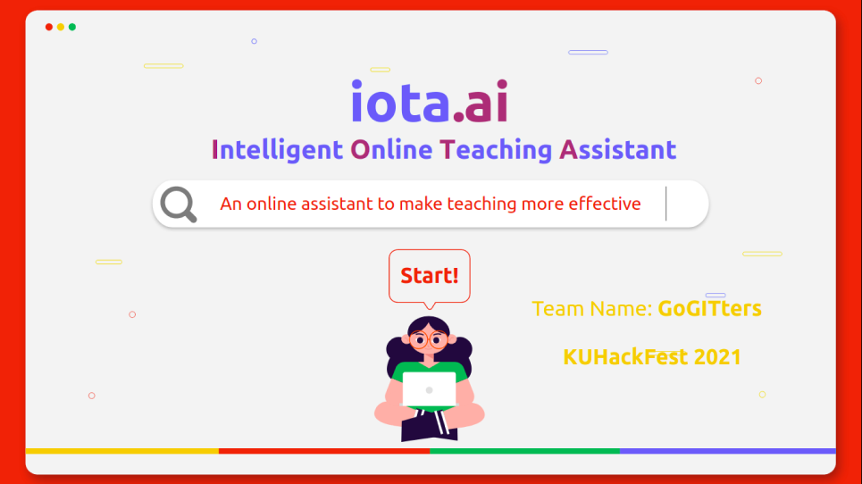
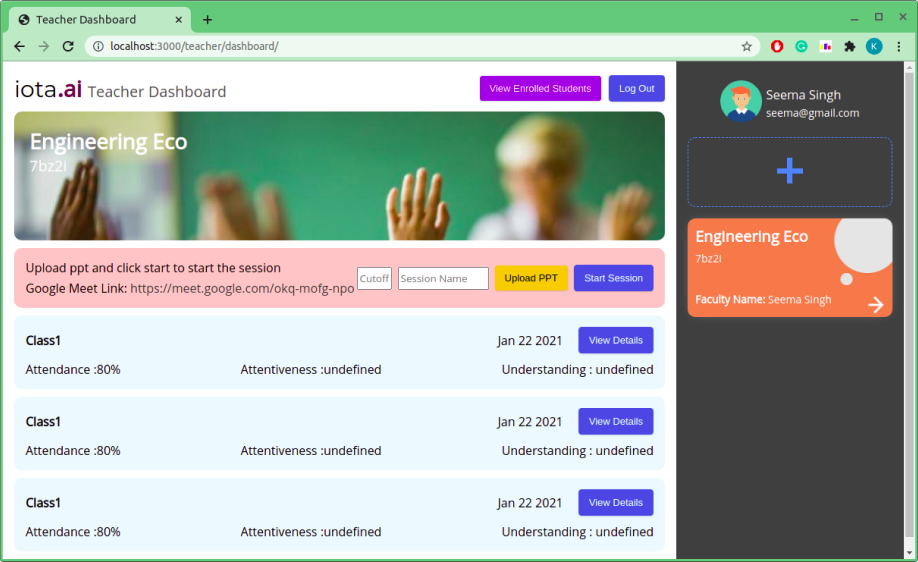

# IOTA 

## Submission to KU HackFest


## Instruction to setup

### Node Server

```console
iota@admin:~$ cd hackathon-backend
iota@admin:~$ npm install
iota@admin:~$ node index.js
```

### Flask Server

Make sure you setup Virtual Enviroment before running the server named venv and install all dependencies for python code

```console
iota@admin:~$ source venv/bin/activate
iota@admin:~$ cd question-answer-generation/
iota@admin:~$ cd QuestionGeneration/
iota@admin:~$ python3 run_api.py 
```
### Java - Stanford Engine Server

Make sure you installed stanford package in lib directory present in question-answer-generation/QuestionGeneration/

```console
iota@admin:~$ java -cp stanford-postagger.jar edu.stanford.nlp.tagger.maxent.MaxentTaggerServer -model models/english-left3words-distsim.tagger -port 9000

```


## Student Dashboard


## Teacher Dashboard


